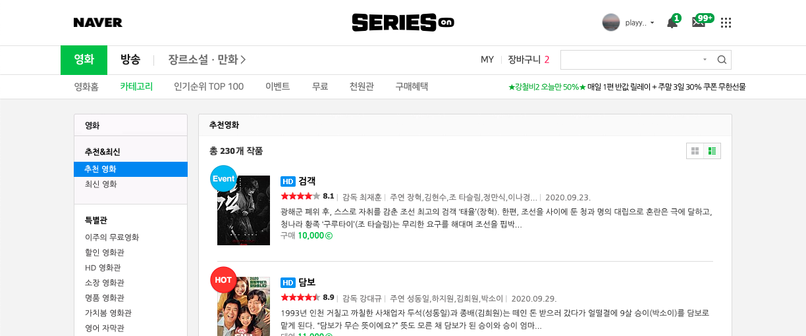
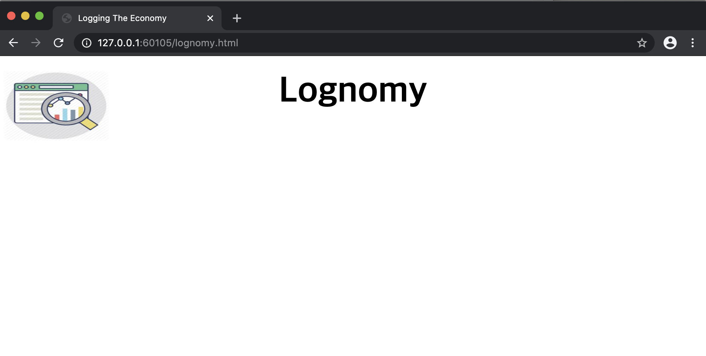

# Lognomy 퍼블리싱 작업일지(2020/11 )

일단... 어렵다는거... 디자인센스는 타고나야 한다는거... 하면서 dyrdl 많이 나왔다는거... 재능은 타고나야..ㅋㅋ

# 벤치마킹

1순위는 네이버 시리즈온 페이지이다. 카카오 메인페이지도 마음에 들긴 했는데 네이버 시리즈온의 배경색깔 선택, 폰트 색상 등 이 마음에 더 들었고, 디자인 센스구린 내가 봐도 괜춘하더라.

## 1순위 - 네이버 시리즈온

[네이버 시리즈온](https://serieson.naver.com/movie/recommendList.nhn)

  

결론 부터 말하자면... 네이버 시리즈온의 모든 CSS 구조를 따라가지는 못했다. 왜냐하면 구조가 그렇게 쉽게 되어있지 않았기 때문이다. 이런 이유로 색상 선택이나, 디자인 감각 같은 부분은 따라갔지만 나머지는 따라가지 않았다. 구조가 어렵기도 했고, 굳이 로그노미에까지 해당 구조를 반영할 필요는 못느꼈기 때문이다.

  

# DAY 01

오늘 진행한 CSS 작업은 아래와 같이 header 작업에 거의 많은 시간을 보냈다. CSS에 대해서 많이 알지 못하기도 했고, 디자인을 바꾸면서 왔다리 갔다리 해서 시간이 살짝 많이 들었다. 그리고 조금 힘들었다...

- header 작업
- left header, right header

퍼블리싱 작업 첫날의 스샷이다. 

네이버 시리즈온을 참고해서 디자인을 만들었는데... 타이포 디자인이 필요한 곳에 이미지를 우겨넣었더니 이미지가 구려서 깜놀했다...ㅋㅋㅋ 그래서 바로 그냥 텍스트로 바꿔버렸다. 친근한 이미지들을 찾아내는 것 역시 시간이 많이 걸렸다.  

- 보완계획중인 내용들
  - 백그라운드가 약간 구리다. serieson의 백그라운드 색상을 선택해보자
  - Lognomy 로고가 구리다. 포샵 온라인 툴을 이용해 이미지 작업을 해야 할것 같다. (무료폰트체로...)

# DAY 02

GNB 작업 시작한다.

