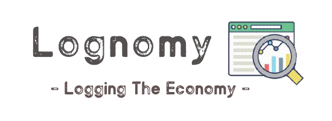
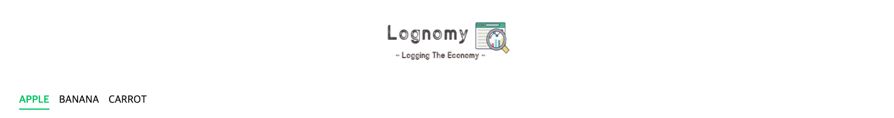
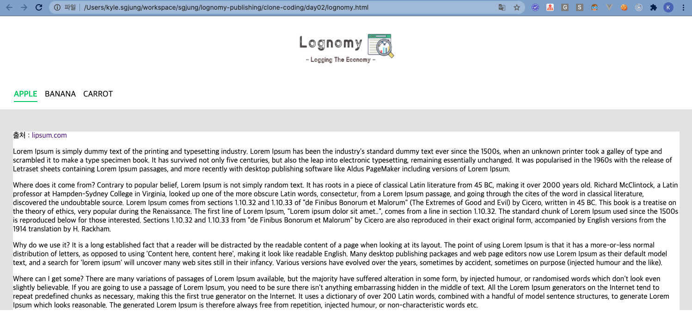

# Lognomy 퍼블리싱 작업일지(2020/11 )

일단... 어렵다는거... 디자인센스는 타고나야 한다는거... 하면서 dyrdl 많이 나왔다는거... 재능은 타고나야..ㅋㅋ

# 벤치마킹

1순위는 네이버 시리즈온 페이지이다. 카카오 메인페이지도 마음에 들긴 했는데 네이버 시리즈온의 배경색깔 선택, 폰트 색상 등 이 마음에 더 들었고, 디자인 센스구린 내가 봐도 괜춘하더라.

## 1순위 - 네이버 시리즈온

[네이버 시리즈온](https://serieson.naver.com/movie/recommendList.nhn)

  

결론 부터 말하자면... 네이버 시리즈온의 모든 CSS 구조를 따라가지는 못했다. 왜냐하면 구조가 그렇게 쉽게 되어있지 않았기 때문이다. 이런 이유로 색상 선택이나, 디자인 감각 같은 부분은 따라갔지만 나머지는 따라가지 않았다. 구조가 어렵기도 했고, 굳이 로그노미에까지 해당 구조를 반영할 필요는 못느꼈기 때문이다.

  

# DAY 02

- 로고작업 시작
  - 계획에 없던 로고작업이었지만, 이걸 하지 않으면 페이지가 구려보일것 같아서 손을 들었다...
  - 막상 하고나니 내가 만든 로고가 나름 괜춘, 귀엽다는 기분이 들었다.
- GNB 작업 시작

## 1) 로고작업 에디터, 이미지 출처 

로고작업에 사용한 이미지와 에디터는 아래와 같다.

### 이미지 출처

작업에 사용한 이미지는 아래와 같다.

- 출처 :
  -  [https://encrypted-tbn0.gstatic.com/images?q=tbn%3AANd9GcTOAldRU9sAKL016CtbDQ-JWlBAYaj8kZwNCQ&usqp=CAU](https://encrypted-tbn0.gstatic.com/images?q=tbn%3AANd9GcTOAldRU9sAKL016CtbDQ-JWlBAYaj8kZwNCQ&usqp=CAU)  
  -  

  

구매하는 곳의 링크는 아래인 것 같았다. 구매링크가 적혀있는 곳을 모두 찾아보았으나 아래의 링크만 발견

- 출처 : [https://icon-library.com/icon/kpi-icon-16.html](https://icon-library.com/icon/kpi-icon-16.html)
- 돈을 충분히 벌고 있는 직장인이기 때문에 비용을 결제하고 사용하려 했으나 무료인것 같아  내비두었다.

## 2) 로고이미지 제작

포토샵을 구매하기에는 너무 사용빈도가 떨어져서 온라인으로 제공되는 무료 포토 편집 에디터를 사용했다.

### 사용 에디터

사용 에디터 : pixlr.com

- [공식 홈페이지](https://pixlr.com/kr/)
- [X 버전](https://pixlr.com/kr/x/)을 선택했다. 

## 3) 완성된 로고이미지 😀

디자인 적으로 대단한 건 아닌데 어떻게 폰트체 고르고 폰트 색상 조합 살짝 왔다리갔다리 하다보니 이렇게 나왔다. 의도하지 않았는데 잘 나왔다. 난 예술가 기질은 없는것 같다. 처음에 아무것도 없는데에서 로고를 어떤 이미지로 만들지? 하고 머리를 쥐어뜯느라 머리가 조금 빠졌다.

## 4) GNB 작업 

CSS 등을 손을 봐서 아래의 화면을 만들어냈다. CSS 너무 어렵다. 지금 만들어놓은 CSS 내용들은 주석으로 덕지덕지한 상태이다. CSS 잘하고 싶은데... 시간이 없어서 참았다...

작업이 끝난 후의 GNB의 모습은 아래와 같다.  

 

아래는 전체화면 스크린샷이다.

## 5) 문제점들& 개선할 내용들

- 배경색
  - 콘텐츠가 있는 부분을 Gray 로 지정했는데... 너무 구리긴 하다. 그냥 흰색으로 두는 것을 고려해야 할듯하다.
- contents 영역의 height scroll 의 최댓값까지로 지정
  - 어려움. 일단 오늘은 여기까지만...

## 6) 다음주 계획

- react router 작업
  - react router 를 적용해서 메뉴를 구현하지 않을까 싶다.
  - 전체 html 퍼블 내용들 안녕~ ㅠㅜ
- 배경색, contents 영역의 height scroll 을 최댓값으로 지정
  - 할꺼다. 할꺼임. 진짜로 할꺼임
- Route53 을 통해 현재 구매한 가비아 도메인을 연결할 예정
  - 11월 말까지는 일단은 html 파일로 퍼블리싱만 보이게끔 해놓을 예정이다.
  - 12월부터 진짜로 Spring Batch App (1 instance, internal) + Spring Boot App (1 instance) 요로코름 시작 예정이다.
  - 보안(시큐리티) 적용할지 고민중이다. OAuth 를 사용할지 말지... 로그인 한 사용자만 볼수 있게끔... 할 생각인데.. 이렇게 하면 또 대문페이지 이미지 작업이 필요하다쓰 😂😂😂

# DAY 01

오늘 진행한 CSS 작업은 아래와 같이 header 작업에 거의 많은 시간을 보냈다. CSS에 대해서 많이 알지 못하기도 했고, 디자인을 바꾸면서 왔다리 갔다리 해서 시간이 살짝 많이 들었다. 그리고 조금 힘들었다...

- header 작업
- left header, right header

퍼블리싱 작업 첫날의 스샷이다. 

네이버 시리즈온을 참고해서 디자인을 만들었는데... 타이포 디자인이 필요한 곳에 이미지를 우겨넣었더니 이미지가 구려서 깜놀했다...ㅋㅋㅋ 그래서 바로 그냥 텍스트로 바꿔버렸다. 친근한 이미지들을 찾아내는 것 역시 시간이 많이 걸렸다.  

- 보완계획중인 내용들
  - 백그라운드가 약간 구리다. serieson의 백그라운드 색상을 선택해보자
  - Lognomy 로고가 구리다. 포샵 온라인 툴을 이용해 이미지 작업을 해야 할것 같다. (무료폰트체로...)

